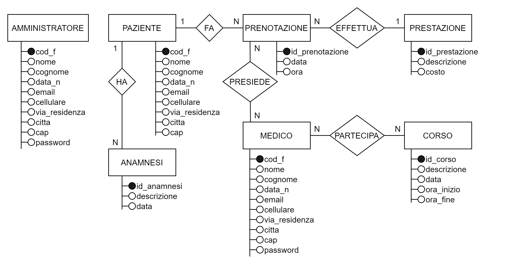

# Analisi

## Schema E/R

## Modello logico relazionale

- **Paziente** ( {cod_f}, nome, cognome, data_n, email, cellulare, via_residenza, citta, cap )
- **Anamnesi** ( {id_anamnesi}, descrizione, data, cod_f* )
- **Prestazione** ( {id_prestazione}, costo, descrizione )
- **Medico** ( {cod_f}, nome, cognome, data_n, email, cellulare, via_residenza, citta, cap, password )
- **Prenotazione** ( {id_prenotazione}, data, ora, cod_p*, id_prestazione* )
- **Presidio** ( {id_prenotazione*, cod_m*} )
- **Corso** ( {id_corso}, descrizione, data, ora_inizio, ora_fine )
- **PartecipazioneCorso** ( {id_corso*, cod_m*} )
- **Amministratore** ( {cod_f}, nome, cognome, data_n, email, cellulare, via_residenza, citta, cap, password )

### Legenda

- _attributo\*_ (con l'asterisco) è FK
- _\{attributo1, \[attributo2...\]\}_ ciò all'interno delle graffe è PK